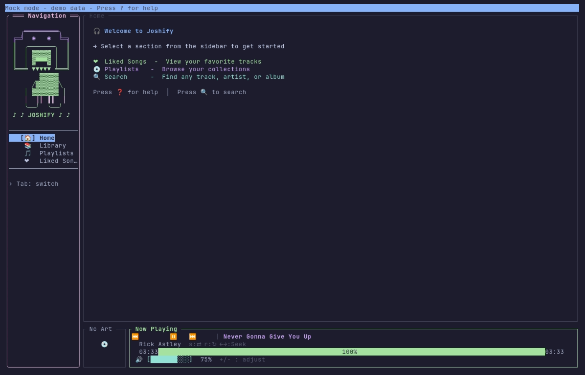
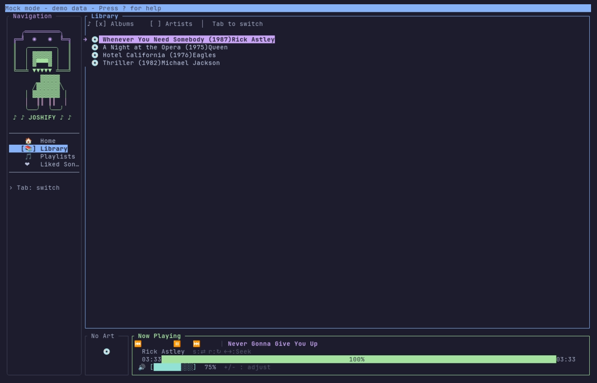
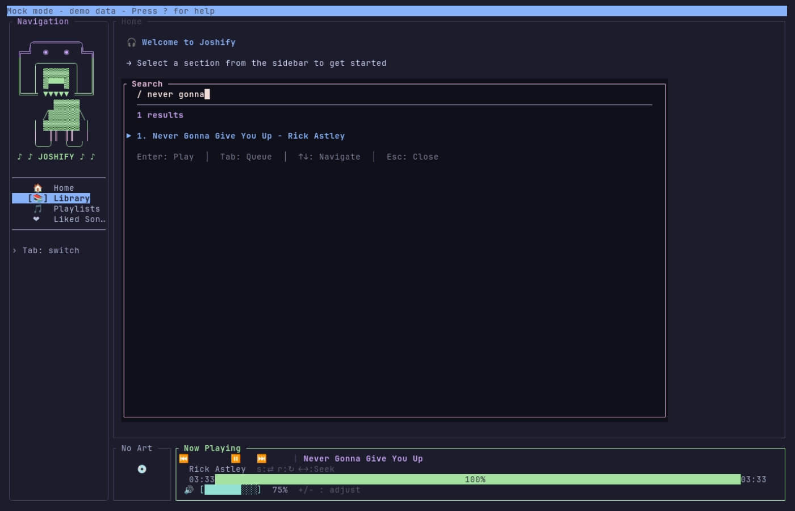

# Joshify ⚡

<p align="center">
  
</p>

<p align="center">
  <b>A beautiful terminal Spotify client built with Rust</b>
</p>

<p align="center">
  <a href="https://github.com/bigknoxy/joshify/actions/workflows/ci.yml">
    
  </a>
  <a href="https://github.com/bigknoxy/joshify/actions/workflows/visual-tests.yml">
    
  </a>
  <a href="https://github.com/bigknoxy/joshify/releases/latest">
    
  </a>
  <a href="LICENSE">
    
  </a>
</p>

<p align="center">
  <a href="#features">Features</a> •
  <a href="#installation">Installation</a> •
  <a href="#quick-start">Quick Start</a> •
  <a href="#screenshots">Screenshots</a> •
  <a href="#documentation">Documentation</a>
</p>

---

## ✨ Features

- 🎵 **Full Spotify Integration** - Play any track, browse playlists, access liked songs
- 🏠 **Local Playback** - Play directly through your computer (no Spotify app needed)
- 🔍 **Fuzzy Search** - Typo-tolerant search with relevance scoring
- 🎨 **Album Art** - Terminal graphics protocols (kitty, sixel, iTerm2) or ASCII fallback
- 📊 **Audio Visualization** - Real-time FFT spectrum visualization (32/64/128 bands)
- 🎤 **Lyrics Display** - Synced lyrics via LRCLIB API
- 📋 **Queue Management** - View and manage playback queue
- 🎭 **7 Beautiful Themes** - Catppuccin, Gruvbox, Nord, Tokyo Night, Dracula, and more
- ⌨️ **Keyboard First** - Vim-style navigation, all actions via keyboard
- 🖱️ **Mouse Support** - Click to play, scroll to navigate
- 🔔 **Desktop Notifications** - Native OS notifications on track change
- 💻 **CLI Mode** - Full command-line interface for scripting
- 🔄 **Daemon Mode** - Background service with IPC control
- 📸 **Visual Testing** - Automated screenshot testing with VHS
- ⚡ **Lightning Fast** - Built with Rust for minimal resource usage

## 📸 Demo

<p align="center">
  
</p>

<p align="center">
  <i>Auto-generated with <a href="https://github.com/charmbracelet/vhs">VHS</a> when the UI changes</i>
</p>

### Screenshots

| Home View | Library View | Search |
|-----------|--------------|--------|
|  |  |  |

## 🚀 Installation

### One-Line Installer (Recommended)

```bash
curl -fsSL https://raw.githubusercontent.com/bigknoxy/joshify/main/install.sh | bash
```

The installer prefers the **prebuilt release binary** for your platform and
only builds from source when there is no matching binary, the download cannot
be verified, or the binary will not run. Re-running it is safe: if the target
version is already installed it exits without doing any work.

Prebuilt binaries exist for **Linux x86_64** and **macOS (Apple Silicon)**.
Everything else builds from source automatically — see
[#33](https://github.com/bigknoxy/joshify/issues/33).

#### Installer environment variables

| Variable | Effect |
| --- | --- |
| `JOSHIFY_VERSION` | Install a specific tag (e.g. `v0.7.2`) instead of the latest release. |
| `JOSHIFY_INSTALL_DIR` | Where to put the binary. Defaults to the directory of an existing `joshify`, else `~/.cargo/bin` if present, else `~/.local/bin`. |
| `JOSHIFY_FORCE=1` | Reinstall even when the target version is already installed. |
| `JOSHIFY_BUILD_FROM_SOURCE=1` | Skip the prebuilt binary and always compile. |
| `JOSHIFY_SKIP_DEPS=1` | Skip the system dependency step and just print the packages to install yourself. |
| `JOSHIFY_ALLOW_UNVERIFIED=1` | Accept a release that publishes no `SHA256SUMS` (releases before v0.7.3). |
| `TMPDIR` | Preferred scratch directory. Respected if binaries can be executed from it; otherwise the installer falls back to `/tmp`, then `~/.cache/joshify/tmp`. |

#### Download verification

Every release publishes a `SHA256SUMS` file. The installer downloads it,
verifies the tarball, and **refuses to install on a mismatch**. If a release
has no checksums it declines the binary and builds from source instead, unless
you set `JOSHIFY_ALLOW_UNVERIFIED=1`.

#### Running without a terminal

The system libraries need `sudo`. When a terminal is attached, the installer
authenticates once up front (via `/dev/tty`, so it works under `curl | bash`)
and reuses the cached credential. When there is no TTY and `sudo` is not
passwordless — CI, background jobs, some SSH/orchestration setups — it does
**not** fail: it prints the packages to install and continues to build Joshify.
Install those packages first, or pre-authorize `sudo`, for a fully unattended run.

Hosts with `/tmp` mounted `noexec` (common on WSL2 and hardened Linux) are
handled automatically — the installer probes the temp directory and relocates
if `rustup-init` could not be executed from it.

### Pre-built Binaries

Download the latest release for Linux x86_64 or macOS (Apple Silicon) from the
[releases page](https://github.com/bigknoxy/joshify/releases/latest).

### From Source

```bash
git clone https://github.com/bigknoxy/joshify.git
cd joshify
cargo install --path .
```

### Prerequisites

- Spotify Premium account
- Terminal with UTF-8 support
- For album art: kitty, iTerm2, or sixel-capable terminal

### Supported Platforms

Pre-built release binaries are provided for **Linux x86_64** and **macOS (Apple Silicon)**.
Other platforms (Intel macOS, ARM Linux, musl) can build from source; broader
pre-built coverage is tracked in [#33](https://github.com/bigknoxy/joshify/issues/33).

System libraries needed to build from source (installed automatically by
`install.sh` when it can elevate — see
[Running without a terminal](#running-without-a-terminal)):
- Linux: `libasound2-dev pkg-config libssl-dev build-essential libchafa-dev libglib2.0-dev`
- macOS: `brew install pkgconf chafa`

### Updating and uninstalling

```bash
joshify update            # update to the latest release; does nothing if current
joshify update --check    # report whether an update exists, change nothing
joshify update --version v0.7.7   # install a specific release

joshify uninstall             # remove the binary, keep config and cache
joshify uninstall --purge     # also delete config, credentials and cache
joshify uninstall --purge --yes   # ...without the confirmation prompt
```

`update` verifies the download against the release's published `SHA256SUMS`
and **refuses to install on a mismatch**. It replaces the binary atomically, so
an interrupted update cannot leave a half-written executable and a running
joshify keeps working. On platforms with no prebuilt binary (Linux aarch64,
Intel macOS — see [#33](https://github.com/bigknoxy/joshify/issues/33)) it says
so and points at `install.sh` rather than installing something that cannot run.

`uninstall` keeps your credentials and cache unless you pass `--purge`, and
`--purge` confirms before deleting them unless you pass `--yes`.

### Headless / non-interactive setup

Run the credential setup and authorization without ever starting the TUI:

```bash
joshify --setup
```

This prompts for your Client ID and Secret, prints the authorization URL, and
waits for the callback on `http://127.0.0.1:8888/callback`. If no browser can
be opened — SSH, a container, WSL — open the printed URL yourself; the callback
still resolves as long as you can reach `127.0.0.1:8888` from that browser.
Under WSL that works from a Windows browser, because WSL2 shares localhost.

To skip the browser entirely, provide credentials you already have. **All of
these are required together** — setting only some of them still opens a browser
and waits:

```bash
export SPOTIFY_CLIENT_ID=your_client_id
export SPOTIFY_CLIENT_SECRET=your_client_secret
export SPOTIFY_ACCESS_TOKEN=your_access_token
# strongly recommended, or the token is treated as expired immediately:
export SPOTIFY_REFRESH_TOKEN=your_refresh_token
export SPOTIFY_TOKEN_EXPIRES_AT=1750000000
```

Or write the two config files directly. Both live in
`$XDG_CONFIG_HOME/joshify` (`~/.config/joshify` by default):

`config.json`
```json
{
  "client_id": "…",
  "client_secret": "…",
  "redirect_uri": "http://127.0.0.1:8888/callback"
}
```

`credentials.json`
```json
{
  "access_token": "…",
  "refresh_token": "…",
  "expires_at": 1750000000
}
```

> `config.toml` in the same directory is a **different** file for audio, UI and
> keybinding preferences. It holds no credentials.

### Running under WSL

- **Do not run as root.** A root session has no `PULSE_SERVER` and a different
  `$HOME`, so neither audio nor the OS keyring works. Credentials silently fall
  back to a file, and local playback has no device.
- **Remote (Spotify Connect) mode works out of the box** — joshify controls
  playback on another device with no audio setup at all.
- **Local playback** additionally needs WSLg plus an ALSA→PulseAudio bridge:
  `sudo apt install libasound2-plugins` and a default of
  `pcm.!default { type pulse }` in `~/.asoundrc`.

Joshify probes the audio device at startup and tells you in the status bar when
it has fallen back to remote-only, rather than claiming local playback and
playing silence.

## 🎮 Quick Start

### Interactive Mode

```bash
# Start Joshify
joshify

# With mock data (no Spotify auth required)
JOSHIFY_MOCK=1 cargo run
```

**Navigation:**
- `Tab` / `Shift+Tab` - Switch between sections
- `↑` / `↓` or `j` / `k` - Navigate lists
- `h` / `l` - Focus sidebar / main content
- `Enter` - Play selected track
- `Backspace` - Go back
- `/` - Search
- `?` - Show help
- `q` - Quit

**Playback:**
- `Space` - Play/Pause
- `n` / `p` - Next/Previous track
- `←` / `→` - Seek ±10 seconds
- `+` / `-` - Volume up/down
- `s` / `r` - Toggle shuffle/repeat

### CLI Mode

```bash
# Control playback
joshify play
joshify pause
joshify next
joshify previous

# Get status
joshify status
joshify current

# Search and queue
joshify search "never gonna give you up"
joshify queue-add <track-uri>
```

### Daemon Mode

```bash
# Start daemon
joshify daemon

# Control via CLI
joshify daemon-send play
joshify daemon-send pause
```

## 🧪 Testing

Joshify has comprehensive test coverage (unit, integration, and doc tests — run `cargo test` for the current count):

```bash
# Run all tests
cargo test

# Run specific test categories
cargo test --lib          # Unit tests
cargo test --test ui      # UI tests
cargo test mock           # Mock data tests

# Visual testing with VHS
./scripts/vhs-setup.sh
./scripts/capture-screenshots.sh
```

## 📁 Project Structure

```
joshify/
├── src/
│   ├── main.rs           # Application entry point
│   ├── ui/               # Terminal UI components
│   │   ├── sidebar.rs    # Navigation sidebar
│   │   ├── player_bar.rs # Now playing bar
│   │   ├── home_view.rs  # Home dashboard
│   │   └── theme.rs      # Catppuccin Mocha theme
│   ├── state/            # Application state
│   │   ├── app_state.rs  # Main state coordinator
│   │   ├── player_state.rs
│   │   └── mock_data.rs  # Mock data for testing
│   ├── player/           # Local playback (librespot)
│   ├── api/              # Spotify REST client
│   └── auth/             # OAuth flow
├── tapes/                # VHS visual test scripts
├── scripts/              # Helper scripts
└── docs/                 # Documentation
```

## 🎨 Themes

Press `T` to cycle through themes:

| Theme | Description |
|-------|-------------|
| Catppuccin Mocha | Default - Dark pastel theme |
| Catppuccin Latte | Light variant |
| Gruvbox Dark | Retro dark theme |
| Gruvbox Light | Retro light theme |
| Nord | Arctic North blue theme |
| Tokyo Night | Dark blue-purple theme |
| Dracula | Classic dark theme |

## 📚 Documentation

- [VHS Usage Guide](docs/VHS_USAGE.md) - Visual testing documentation
- [Architecture Overview](#architecture) - Technical details
- [Contributing](CONTRIBUTING.md) - How to contribute
- [Changelog](CHANGELOG.md) - Version history

## 🏗️ Architecture

Joshify uses a modular architecture:

- **UI Layer** (`src/ui/`) - Ratatui-based terminal interface
- **State Layer** (`src/state/`) - Application state management
- **Player Layer** (`src/player/`) - librespot local playback
- **API Layer** (`src/api/`) - Spotify Web API client
- **Auth Layer** (`src/auth/`) - OAuth authentication

### Key Design Patterns

- **State Isolation** - Each domain has its own state module
- **Coordinator Pattern** - `LoadCoordinator` manages async data loading
- **Mock Data** - `JOSHIFY_MOCK=1` for testing without auth
- **Pre-processing** - Heavy work done once, not per-frame

## 🤝 Contributing

Contributions welcome! Please read [CONTRIBUTING.md](CONTRIBUTING.md) first.

### Development Setup

```bash
# Clone the repo
git clone https://github.com/bigknoxy/joshify.git
cd joshify

# Install dependencies
cargo build

# Run tests
cargo test

# Run with mock data
JOSHIFY_MOCK=1 cargo run
```

## 📄 License

MIT License - see [LICENSE](LICENSE) for details.

## 🙏 Acknowledgments

- [ratatui](https://github.com/ratatui-org/ratatui) - Terminal UI framework
- [librespot](https://github.com/librespot-org/librespot) - Spotify Connect library
- [rspotify](https://github.com/ramsayleung/rspotify) - Spotify Web API client
- [Catppuccin](https://catppuccin.com) - Beautiful color theme
- [VHS](https://github.com/charmbracelet/vhs) - Terminal recording

---

<p align="center">
  Built with ⚡ by <a href="https://github.com/bigknoxy">bigknoxy</a>
</p>

<p align="center">
  <a href="https://github.com/bigknoxy/joshify/stargazers">⭐ Star this repo</a> •
  <a href="https://github.com/bigknoxy/joshify/issues">🐛 Report issues</a> •
  <a href="https://github.com/bigknoxy/joshify/discussions">💬 Discussions</a>
</p>
